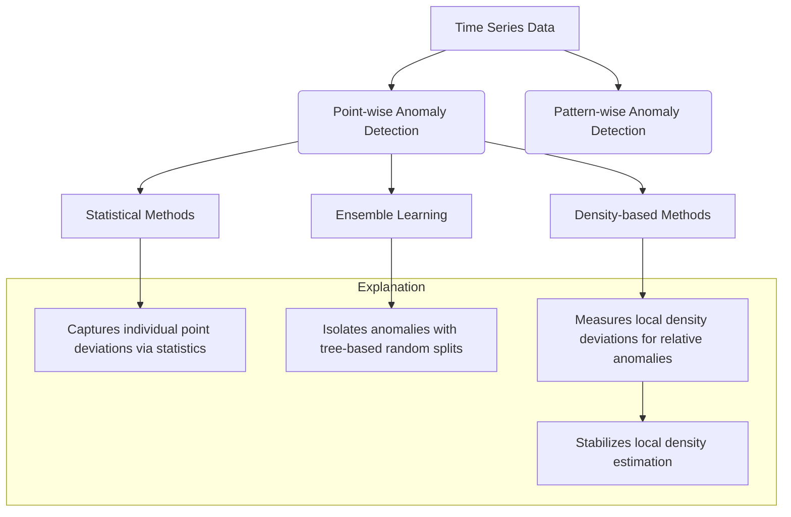

# Time Series Anomaly Detection

This repository contains my implementation and experiments with various techniques for **time series anomaly detection** using Python. The objective of this project is to identify unusual patterns or events that deviate significantly from expected behavior in temporal data. Anomalies can indicate critical issues such as system malfunctions, security breaches, or operational changes.

## Overview of Anomaly Detection in Time Series

Anomaly detection in time series broadly falls into two categories: **point-wise** and **pattern-wise** detection.

- **Point-wise anomaly detection** identifies individual time points that deviate significantly from typical behavior. This approach is useful for detecting spikes, drops, or isolated outliers occurring at specific time instances.
- **Pattern-wise anomaly detection** focuses on identifying anomalous subsequences or segments within the time series that exhibit unusual patterns compared to normal segments. This is important for detecting complex anomalies such as recurring abnormal cycles or changes in temporal trends.

This repository emphasizes **point-wise anomaly detection** methods but the foundations can extend to pattern-wise approaches with additional modeling and segmentation.

## Techniques Implemented

### Mean Absolute Deviation (MAD), Z-Score, and Robust Z-Score

Classical statistical methods provide foundational approaches to point-wise anomaly detection by quantifying deviations from central tendency.

- **Mean Absolute Deviation (MAD)** measures average absolute deviations from the mean, offering a simple way to quantify variability around the mean.
- **Z-Score** expresses how many standard deviations a data point is from the mean. It assumes data is normally distributed and is sensitive to outliers because mean and standard deviation are influenced by extreme values.
- **Robust Z-Score** replaces the mean with the median and the standard deviation with the Median Absolute Deviation, making it resistant to skewed data and extreme outliers. It is computed as:

$$
\text{Robust Z-Score} = \frac{x_i - \text{median}(X)}{\text{MAD}(X)}
$$

Robust Z-Score is especially suited for anomaly detection in noisy or non-Gaussian time series, as it more accurately captures typical behavior without distortion by outliers or heavy tails.

### Isolation Forest

Isolation Forest is an unsupervised ensemble learning method tailored for anomaly detection. It isolates anomalies instead of profiling normal data points.

- The algorithm builds multiple binary trees by randomly selecting features and split values.
- Anomalous points tend to be isolated with fewer splits since they differ significantly from the majority of data.
- Isolation Forest assigns an anomaly score based on the average path length required to isolate a point; shorter paths indicate higher likelihood of anomaly.

This approach works well for high-dimensional or complex datasets without assuming any data distribution, providing a scalable and effective anomaly detection method.

### Local Outlier Factor (LOF) and Reachability Distance

Local Outlier Factor (LOF) is a density-based anomaly detection method that measures the relative density of a point compared to its neighbors, capturing local deviations.

- LOF assigns an anomaly score by comparing the local density of a point to the densities of its k-nearest neighbors.
- Points with significantly lower density than their neighbors have high LOF scores and are considered outliers.

A crucial concept in LOF is **reachability distance**, which smooths density estimates to avoid distortion by single points:

$$
\text{reachability-distance}_k(A, B) = \max(\text{k-distance}(B), \text{distance}(A, B))
$$

where:

- $$\text{k-distance}(B)$$ is the distance between point $$B$$ and its $$k^{th}$$ nearest neighbor,
- $$\text{distance}(A, B)$$ is the actual distance between points $$A$$ and $$B$$.

Reachability distance ensures a stable measure of neighborhood density by preventing very close points in sparse areas from artificially inflating density estimates.

LOF’s focus on local relative density rather than global distance makes it effective for datasets with varying density regions and complex cluster structures.

***

## Summary Diagram of Techniques

***

## Educational Rigor and Readiness

Through this project, I have demonstrated a thorough understanding of both foundational statistical approaches and advanced machine learning techniques for anomaly detection. The implemented methods cover a spectrum of scenarios including distribution assumptions, model-free detection, and local neighborhood analysis. This breadth reflects capability with core concepts and practical mastery valuable for real-world data science challenges involving time series analysis.

The explanations and implementations emphasize robustness to data noise, interpretability through visualization, and quantitative evaluation against labeled benchmarks, highlighting an ability to deliver reliable, production-ready insights.
